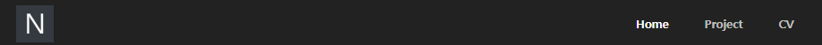
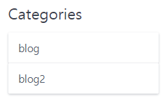

작업중인 https://www.solvigchoi.co.uk 사이트에 카테고리를 도입하려고 하는데, 현재 사용 중인 테마로는 카테고리처럼 만들면 아래 사진 처럼 상단 네비바에 상단 메뉴가 추가되는 형태라서 



한 단계를 내린달까? 메뉴쪽은 그대로 두고 **사이드바**에만 나오도록 하는 것이 목표. Grav의 구조를 아직 다 잘 모르니 일단 소스 여기 저기를 쑤셔 보려고 한다. DB를 사용 하는게 아니라 flat-file 구조라서 좀 생소하지만 NoSQL 다루는 것 같기도 해서 재미있다.(아직 까지는)   

그리고 plugin 으로 리팩토링 해서 배포하는건 좀 나중에... https://learn.getgrav.org/plugins/plugin-tutorial

1. `item.md` 의 `category` 항목의 데이터를 분류 가능 한지 테스트 해 보기 위해 과거 글을 하나 찍어서 category를 blog2 로 바꿔 놓음. 이렇게 하면 1) 카테고리가 없는 글 2) blog인 글 3) blog2 인 글 이렇게 3가지 데이터가 존재 하게 됨  
2. `templates/partials/sidebar.html.twig` 를 보면 따로 카테고리 처럼 출력시키는 모듈은 안 보인다. `taxonomylist.html.twig` 에서 태그 다루는 것 처럼 해야 할 듯 
3. 이 쯤에서 공식 메뉴얼을 보자. `https://learn.getgrav.org/content/taxonomy` 하고 `https://learn.getgrav.org/api#class-gravcommontaxonomy` 를 참조해서 목록을 불러오는 테스트를 해 보자. 
4. `sidebar.html.twig`에 `categories.html.twig`를 서치바 아래서 include 하도록 하고 파일을 생성 시켜 준다.

```twig

<div class="sidebar-content">
    
</div>


<!-- Categories -->
<div class="sidebar-content">

</div>
<!-- End of Categories -->


<div class="sidebar-content">
    <h4>{{ 'THEME_QUARK.SIDEBAR.RELATED_POSTS.HEADLINE'|t }}</h4>
    
</div>

```

5. 그리고 `categories.html.twig` 를 `relatedpages.html.twig`를 참조해서 다음과 같이 작성 한다. 

```twig

<ul class="menu">
    <li class="menu-item">        
        <a href="/category:{{ cat }}" title="{{ cat }}">{{ cat }}</a>
    </li>
</ul>

```



어 되네? 쉽네 
