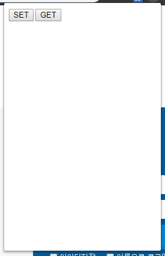

어휴, https://blog.noizze.net/blog/745 분명히 예전에 한번 만들어서 런칭하고 200명 정도의 사용자까지 성공 했는데,  하도 오래되서인지 어떻게 크롬 브라우저 확장 개발을 시작하는지 다 까먹었네. 그리고 소스를 도대체 어디에 백업을 해 놓은 거지? github에 있을 꺼라고 생각 했는데 막상 내 레포지토리엔 없고 Dropbox 에도 없고, Sync 에도 없고. 

그리하여 일단 더이상 유지보수 하고 있지 않은(반응도 안 좋고) 예전 SlideShare 확장은 임시로 github에 올려 놨음. https://github.com/YUChoe/Large-screen-slideshare-Chrome-extension

그리고 예전 기록이 없으면 메뉴얼 보고 다시 만들어야지 별 수 있나.

[메뉴얼](https://developer.chrome.com/extensions/getstarted)

#### prototype goal
* 특정 socks5 서버에 접속
* 팝업을 통해 on/off 시킬 수 있을 것
* on/off 상태를 아이콘으로 구별 할 수 있을 것 

#### manifest.json 

```json
{
    "permissions": [ "proxy", "storage", "<all_urls>" ],
   
    "background": {
        "scripts": ["proxy.js"]
    },
    
   "browser_action": {
        "default_title": "ProxyTest",
        "default_popup": "popup.html"
    }
}
```
대략 일단 가장 기본 적인 접속 테스트를 위해 manifest는 이 정도로 설정 해 놓고 

#### proxy.js
기본적인 기능을 작성한다.

```js
'use strict'

let Proxy = {};

Proxy.make_connection = function() {
    var config = {
        mode: "fixed_servers",
        rules: {
                singleProxy: {
                    scheme: "socks5",
                    host: "1.2.3.4",
                    port: 1024
                },
                bypassList: ["localhost", "api.socks5.your.server"]
        }
    };
    
    chrome.proxy.settings.set(
        {
            value: config, 
            scope: 'regular'
        }, 
        function() { Proxy.get_setting(); }
    );

}

Proxy.get_setting = function() {
    chrome.proxy.settings.get({}, function(config) {
            console.log( config.value );
        });
}
```

#### popup.html
아이콘을 누르면 상태와 기능을 제공 할 팝업. 익숙하니까 jquery 를 쓰자. 디자인은 나중에 spectre 정도면 가볍고 무난 할 듯.

```html
<html>
    <head>
        <title></title>
        <script type="text/javascript" src="libs/js/jquery.min.js"></script>
        <script type="text/javascript" src="proxy.js"></script>
        <script type="text/javascript" src="popup.js"></script>
        <style>
        body {
            width: 250px; height: 400px;
            overflow-x: hidden;
            overflow-y: scroll;
        }
        </style>
    </head>
    <body>
        <input id="set_button" type=button value="SET" />
        <input id="get_button" type=button value="GET" />
    </body>
</html>
```

#### popup.js
백그라운드의 `proxy.js`와 연계 해서 이벤트를 처리 해 줄 수 있게 한다. 

```js
'use strict'

let Popup = {}

document.addEventListener('DOMContentLoaded', function() {
    Popup.addButtonsListener();
});


Popup.addButtonsListener = function() {
    $("#set_button").click(function() {
        Popup.set_button();
    });
    $("#get_button").click(function() {
        Popup.get_button();
    });
}

Popup.set_button = function() {
    Proxy.make_connection();
}

Popup.get_button = function() {
    Proxy.get_setting();
}
```

#### 실행 

일단은 실행 잘 되고, 프록시 서버와 연결도 잘 되는 것을 확인 

