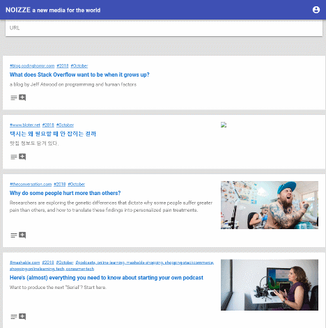

처음 시작은 2012년 한참 일베 등의 게시판 어뷰징이 시작되는 시기여서 기존의 코멘트와 추천 방식은 트롤링에 속수무책으로 당할 수 밖에 없다는 생각에 2차원적인 쓰레드를 시각화 하는 쪽에 촛점을 맞추어서 wordpress 플러그인 형태로 구성 하다가 중단 한 후에 플렛폼을 바꾸거나 일간워스트를 모델로 새로 처음부터 작성 해 보거나 백엔드 DB를 mongodb, cassandra 등으로 바꾸는 실험을 해 왔었다. 

그리고 현재의 AWS serverless 구조로 왔다. 현재는 AWS의 Route53, lambda, dynamodb, S3 로 구성 되어 있고 Hacker news와 Reddit의 포스트 형태 중에 링크만 올려서 공유 하는 형식으로 간단히 만들려다가 다음의 문제로 또 다시 중단 되었다. 

1. 디자인 문제 : 레이아웃과 1픽셀, 1포인트 폰트 크기 때문에 얼마나 시간을 많이 허비하는지 모른다. 
2. node.js : 공부 부족이겠지만 promise 문제 때문에 의도한 대로 진행이 힘듬. 공부는 즐겁지만 시행 착오로 허비되는 시간이 얻는 것보다 너무 큼
3. 페이지 서머리 기능 : 가장 핵심 기능이기도 하지만 처음 기획할 때는 외부 패키지 가져와서 쓸 수 있을 꺼라고 생각 했는데, 생각보다 쓸모 있는 것들이 안 보여서 결국 메타 데이터 파서 정도로 진행 했더니 품질이 너무 나빠졌다. 나쁜 타협의 예. 
4. 흥미를 잃음 : 더 바쁘고 중요한 일들이 많기에...

그래서 포럼/커뮤니티에 광고 걸어놓고 잔돈 벌어서 서버비용과 커피값 정도 벌어 보려는 작은 희망도 실현되지 않았다. 

(계속)