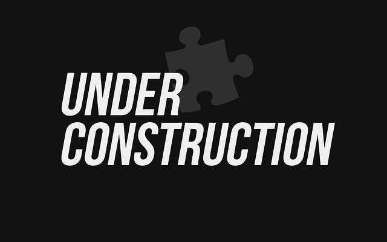

라즈베리파이로 구축 해 놓았던 웹서비스가 해외에 나가 있는 동안에 다운이 되었다. 외부에서 원인도 모르고 누구를 시켜서 서버에 콘솔 붙여보고 재부팅 시킬 수도 없는 상황이어서 답답했었는데, 한국에 돌아와서 확인 해 보니 콘솔은 Kernel Panic 으로 죽어 있고 재부팅을 해도 안 되길래 다른 리눅스 머신에 외장으로 붙여보니 마운트도 안되는 Media Fail. 

다행히도 하루에 두번씩 백업을 해 놓고 있어서 데이터 복구는 문제 없었는데 이렇게 기존 홈호스팅을 계속 하느냐 아니면 지출이 생기지만 호스팅 서비스를 알아보느냐의 고민을 하게 되었다. 

결론은 AWS lightsail로 간 다는 것이고, 새 모듈이나 실험적인 개발을 바로 옆에 있는 물리적 서버에서 할 수 없지만 월 $ 3.5 으로 운영 부담이 준다면 괜찮을 것이라고 생각 했다. 

그래서 복구 완료. lightsail에서 linux(ubunntu) + php7.2 + Grav 로 작동 합니다. 
