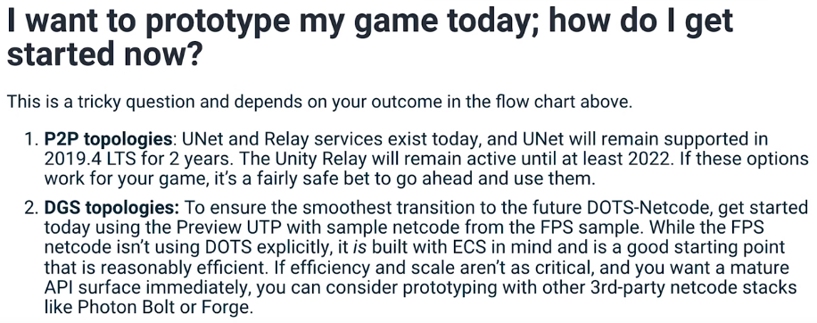

고민하던 UNITY3D의 멀티플레이어 정책과 현재 상황에 대한 정리 비디오가 올라와서 봤는데...

일단 2019.4 LTS 를 이용하면, 지금 시스템을 유지한 상태로 2022년 까지는 돌릴 수 있으니 UNet으로 계속 진행 하기로 했음. 올해나 내년 초에 런칭한 후에 사용자가 많아지면 그때 가서 고민해도 늦지 않을 듯. 수익이 생기면 개발자를 두는 방법도 있으니... 

문제는 만약 내 게으름에 런칭을 못하고 주물럭대다가 시기를 놓치면 아에 처음부터 내가 다시 공부해서 프로토타입을 또 만들고 또 만드는 상황이다. 2009년부터 cocos2d 가지고 아이폰에서 한참을 그렇게 해 놨으니 이젠 좀 완성을 시켜 봐야지. 

