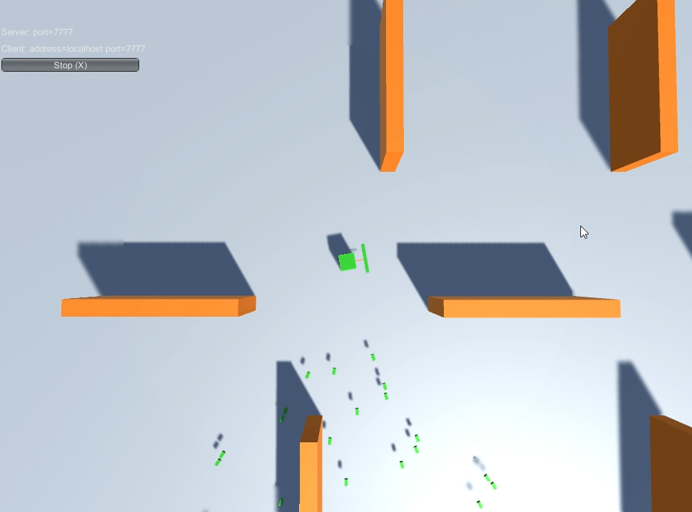

친구의 도움을 받아서 로컬 네트워크가 아닌 인터넷을 통해 로비 기능이 정상적으로 작동하는 것을 확인 했음. 이제 진행 중인 부분은 

* 로비 GUI 작성 
* 총알(Bullet)이 동기화가 정확히 안 되는 문제 
* 게임 오버 표시 
* 오른 클릭으로 벽을 세우는 스킬 테스트

그리고 재미 있는(?) 것은 기본적으로 syslog 를 지원하지 않는다. 파일로만 접근 가능 한데... 프레임웍을 가져다가 직접 패킷을 만들고 해야 하는데 이건 언어 core 에 들어있어야 하는 것 아닌가? 이렇게 윈도우와 다른 OS 앱 만드는 마인드셋이 다른 걸까? (참조: https://docs.unity3d.com/kr/current/Manual/LogFiles.html)

그리고 로비를 만들기 위해 참조 한 비디오 튜토리얼 

