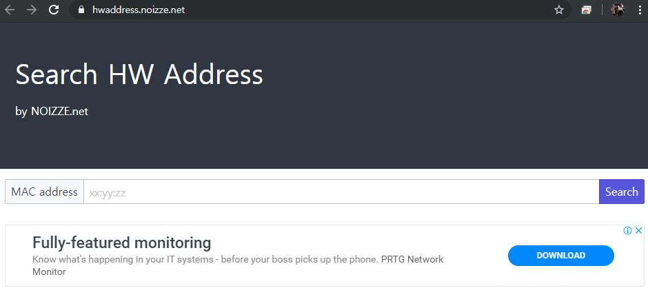

https://hwaddress.noizze.net 

직업상 일 하다보면 맥어드레스를 검색 할 일이 많아서 기존에 거의 10년 동안 hwaddress.com 사이트 사용하다가 요즘 들어 오류도 잦고 사이트 속도도 느린 문제가 있어서 내가 쓰기 위해 만듬. 광고도 걸어 놨으니 다른 사람들도 많이 써 주면 좋고, 아님 말고. 

* AWS S3 에 static web service 
* AWS CloudFlare + Route 53 으로 https 서비스 
* 그리고 검색을 위해 AWS lightsail 에 python + Flask 로 간단히 API 서버 구축 
* github: https://github.com/YUChoe/hwaddress

