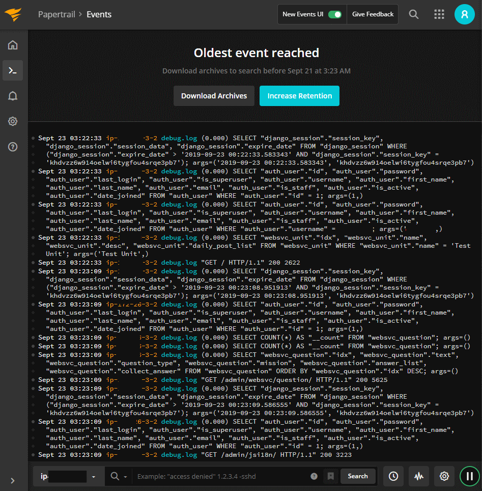

예전 부터 지켜 봐 오던 Centralized Logging System 중에 최근에 어디 큰 곳으로 합병 되었다는 소식을 들은 papertrail 이 있다. 올 초에 VPN 서비스 로그 모니터링을 위해 가입을 했다가, 일주일 단위로 뭐 도와줄것 없냐고 계속 메일을 보내 와서 답장을 할 까 말까 좀 부담 되기는 했는데 암튼 이 서비스에서 제공하는 무료플랜과 remote_syslog2 라는 프로그램이 아주 편리해서 기록을 남기고 다른 서비스에도 적용을 해 볼까 한다. 

우선 django 프로젝트의 `settings.py`에 다음의 로그 헨들러를 넣는다. filename 항목에 로그파일의 위치를 확인 할 것.

```python

LOGGING = {
    'version': 1,
    'disable_existing_loggers': False,
    'handlers': {
        'file': {
            'level': 'DEBUG',
            'class': 'logging.FileHandler',
            'filename': '/tmp/business365_django_debug.log',
        },
    },
    'loggers': {
        'django': {
            'handlers': ['file'],
            'level': 'DEBUG',
            'propagate': True,
        },
    },
}
```

그리고 papertrail 의 메뉴얼을 따라 remote_syslog2 를 설치 하고, (내 경우는 ubuntu 18.04여서 제공해 주는 deb으로 설치) `/etc/log_files.yml` 을 수정. 

```yaml
files:
  - /tmp/business365_django_debug.log
destination:
  host: logsxx.papertrailapp.com
  port: 7813
  protocol: tls
exclude_patterns:
  - don't log on me
  - first seen with mtime
```

papertrail 에서 계정에 제공하는 호스트와 포트를 확인. 

위와 같이 설치하고 설정하면 간단히 서버의 로그를 웹UI를 통해서 모니터링이 가능하다. 