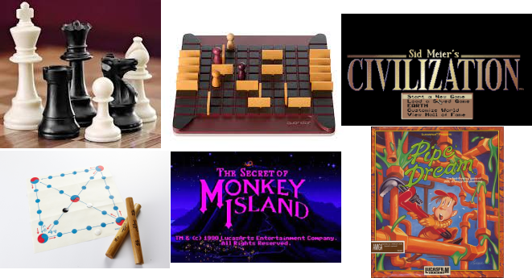

# 체스

+ 큰애(7살9개월)는 간단한 룰은 이미 알고 있는 상태였고 봇 상대로 이긴다고 했음
+ 애기엄마가 허락치 않아 사람 상대로는 못해게 했음
+ 하는 거 보여달라고 해서 보니까 말을 두고 언두랑 힌트, 그리고 질만하면 리셋하고 있었읍
+ 그렇게 하지 말라고 이야기 하니 금방 흥미가 떨어지고 그만 하고 싶어 함
+ 봇 상대로 둘이서 같은 팀(?)으로 같이 하면서 왜 이 무브를 하려고 하나를 설명해달라고 했다.
+ "이기니까" 좋아하긴 한데 막 재미있어서 또 하려고 그러진 않는 듯.

# 윷놀이

* 규칙을 좀 간소하게 줄였다가 하나씩 늘리는 식으로 해 봄
* 아직 애들에게는 엎거나 먹는 작전이 힘들다.
* 즐거웠다면 다행인데 큰애는 2번 연속으로 지고 결국은 울었다
* 친구들한테 설명하고 같이 놀 수 있을라나?
* 작은애(3살6개월)은 아직 규칙과 순서를 이해 못함 

# 쿼리도

* 큰애가 처음으로 날 이기고 좋아하더라
* 친구들과도 즐길만한 게임인듯

# 문명1
* 역시 큰애랑 해 보는데 처음엔 아무런 힌트를 안줬는데 보니깐 조금 하다가 바바리안 처들어오고 병력잃고 게임오버를 반복하길래
* 유튭에서 설명해주는 비디오 찾아서 같단히 알려 줌
* 키보드도 제한적이고 마우스 없이 트랙패드랑 터치스크린으로만 하려니 조작이 안되서 힘들어 했고(무엇보다 자기가 마우슬 싫어함)
* 아직은 약간 어려운듯?

# 파이프드림
* 라이선스 풀려있는 버전 찾기 너무 힘들었음 
* 퍼즐에 시간제한이 있는데다가 마우스없이 트랙패드랑 터치스크린으로만 하려니 조작이 안되서 금방 흥미 잃음 

# 원숭이섬의비밀1
* 벌써 3년 째 시도 중인데 아직 7살에겐 좀 힘들다
