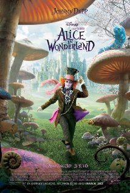

여자아이의 로망 - 백마 탄 왕자를 기다리는것이 아니라 스스로 내 운명을 개척하기를 원하는 !!! 주인공에 사춘기 소녀가 자신을 투영하기엔 다 커버린 20살 처자라는게 에러랄까?

영화 내내 내가 알던 "이상한 나라의 앨리스"가 아닌데, 하면서 기억력을 의심했음. 역시나 조금 있으니 앨리스가 이상한 나라에 다녀온지 17년 후이고 앨리스는 첫번째 이상한 나라의 방문을 꿈으로 알고 있었으나 사실이었다.. 뭐 그런 이야기

앨리스역의 미아 와시코우스카는 기네스펠트로를 연상케 하는 매력적인 외모를 가졌으나 연기는 안타깝게도 무미 건조하고 호주 악센트인지 브리티시 안센트인지 구분이 힘든 발음을 가졌던 것이 특징이랄까? 다음 영화인 제인 에어를 보게 되면 그때 다시 한번 평가 해 주리라

조니뎁의 매드해터의 연기는 조연을 주연으로 만들 정도로 너무 진한 색을 보여 거슬린다. 전혀 주연을 서포트 해 주지 못하는 존재감이랄까?  국내 개봉 포스터도 조니뎁의 분장한 무서운 얼굴이 전부였던 것으로 보아 감독의 실제 목적이 그거 였을 수도 있겠지만

결론 : 이상한나라의 앨리스 원작 한번 쯤은 읽고 보는 것이 수많은 등장인물을 이해 하는데 수월함. 팀버튼의 팬이라면 볼 만함.