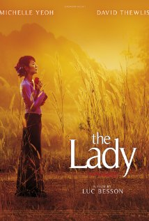

미얀마(버마)의 민주화 운동의 중심 인물이자 민주주의민족동맹(NLD, National League for Democracy) 의장이며 1991년 노벨 평화상 수상자인 아웅산 수 치 의 2011년 까지의 삶을 담은 영화.

1. 독립영웅이자 아버지인 보조 아웅 산 에 대한 평가/비판 없이 그냥 선한 지도자로 넘어감
2. 가택 억류 기간 동안의 생활이 너무 축소 된 감이 있음
3. 부군되시는 킴교수, 가족과의 이야기가 중심이 되어서 십수년간을 투쟁해 온 강한 여성 지도자의 약한 모습을 보여주려 하지 않았는가 하는 감독의 의도가 있지 않은가 생각 됨
4. 군부와 그 개들의 잔혹한 장면들은 우리나라 대한민국의 1980년, 1987년이 연상되서 마음 편하게 만은 볼 수 없었음

2012년 4월 보궐선거에서  85%의 의석을 확보한 NLD와 아웅산 여사의 건투를 빈다.