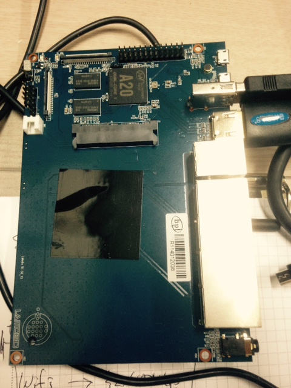

* BIOS가 없어서 microSD에 부팅 이미지 없으면 화면 구경 조차 못함
* [http://www.lemaker.org/portal.php?mod=list&catid=4](http://www.lemaker.org/portal.php?mod=list&catid=4) 에서 필요한 이미지 받는다.
* 압축풀고
* `sudo dd if=bananian-1504.img of=/dev/disk3 bs=1m`
* `diskutil eject /dev/disk3`
* 본체에 넣고 전원 연결하면 빨간불 -> 녹색불 들어오면서 자동으로 부팅
* 프롬프트 나오면 디폴트 계정으로 로그인

관련 네이버 카페 : [http://cafe.naver.com/bananapi](http://cafe.naver.com/bananapi)