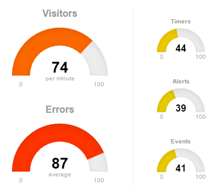
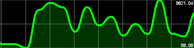

* 게이지 : [http://justgage.com/](http://justgage.com/)

bootstrap 과 잘 어울리고 간단해서 채택.  데모는 잘 되어 있는데 소스 예제가 gage.refresh(new_value); 형식으로 업데이트 해 준다는 걸 찾는데 시간이 걸릴 정도로 사용메뉴얼과 관련 커뮤니티는 그다지 활발하지는 않음.

* 트렌드 그래프 : [http://smoothiecharts.org/](http://smoothiecharts.org/)

다 좋은데, 문제는 같은 값이 반복해서 들어올 경우 flat한 그래프가 아닌 아무것도 그리지 않는 다는 것이다. 또는 아직 방법을 못찾았다.

* [타이머](http://www.jqueryscript.net/loading/Easy-jQuery-Progress-Bar-Timer-Plugin-For-Bootstrap-3-progressTimer.html)
* [테이블](https://datatables.net/)