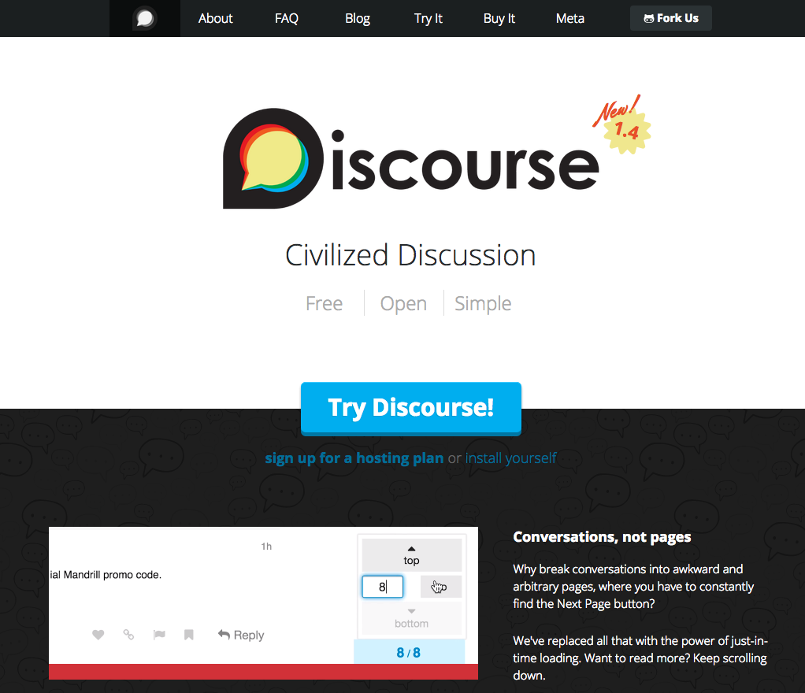
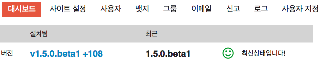

[Let's Encrypt 프로젝트](https://letsencrypt.org/) 진행상황을 보다가, 커뮤니티가 [stackoverflow](http://stackoverflow.com/) 스타일도 아닌 것이 깔끔하게 잘 되어 있는 것으로 보여서 찾아보니 [http://www.discourse.org](http://www.discourse.org)였다. 마침 회사 홈페이지에 이슈, 오픈소스 및 knowlegde base 커뮤니티가 필요했는데 잘 되었다 싶어서 바로 시작.

* VM으로 2vCPUs, 1GRAM, 32GHDD 생성 후 ubuntu 14.04 설치 하고
* https://github.com/discourse/discourse/blob/master/docs/INSTALL-cloud.md 메뉴얼에 따라 설치. docker는 처음 써보는데 CDN문제가 있었는지 이미지를 가져오지 못하고 느려지고는 해서 약간 당황스러웠다.
* https 설정. 사설인증서를 사용했는데, 별 무리없이 잘 되었고 http로 접속하면 자동으로 https로 전환도 시켜 줌. https://meta.discourse.org/t/allowing-ssl-for-your-discourse-docker-setup/13847
* CI 교체는 /admin/site_settings/category/required 메뉴에서 진행.
* 한글화. 번역이 이상하거나 잘 안 된 부분이 있는데 contribute 할 수 있는 방법이 있는지 알아보는 중 https://www.transifex.com/discourse/discourse-org/
* 메일 서버연동이 안 돼서 rebuild를 몇번을 했는지... 결국은 내부망에서 TLS를 끄는 설정으로 작동 되게 함.
* 플러그인
   * RADIUS 연동, gitlab 연동 등 시도해 볼 예정
   * 업그레이드. 아래처럼 보이긴 한데, 클릭하면 자동 업그레이드가 되는 걸까? 
   