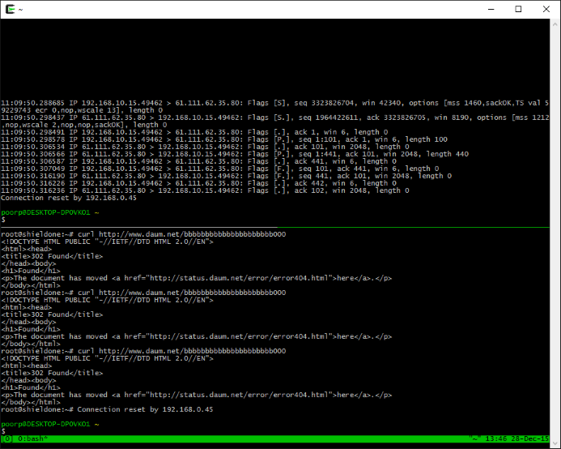

OSX 에서 iTerm 을 주로 써 와서, 화면을 split 하는 기능을 편하게 썼는데, 윈도에서 putty로 CLI 작업을 하려니 창들을 배열하는게 계속 신경 쓰였다. 그러다가 예전부터 그냥 있는 줄은 알았는데 어떻게 써먹어야 할지 모르겠던 screen 과 tmux 중에 tmux를 한번 도입 해 봤다.
[단축키](http://unix.stackexchange.com/a/25655)가 많이 어색하기는 한데.. 그럭저럭 iTerm 쓸때 처럼 쓸 수 있게 된 것 같다.

putty가 0.66 이후로 진행이 없게 된 지가 거의 10년이 다 지난 것 같은데 conemu 등 cmd 를 대체 하는 것들이 주로 보이고 윈도우용 터미널 개발쪽은 누가 선듯 나서는 기미가 없어 보인다. putty 세션관리와 다국어 지원 쪽으로 조금만 더 보완해주고.. 내가 원래 원했던 창 split 기능까지 들어가면 더 편하게 될 수 있을 것 같은데