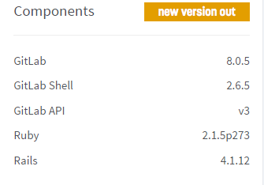

처음 설치 했을때가 2013년 1월인가 그때 부터여서 유지보수가 힘들고 문서도 많이 봐야 하고 그럴 때에도(나름 애정을 가지고) 꼬박꼬박 업그레이드를 해 오다가 몇 달 전 7-14에서 8-0으로 메이저 업그레이드 때 아무 생각 없이 기계적으로 https://gitlab.com/gitlab-org/gitlab-ce/blob/master/doc/update/7.14-to-8.0.md 메뉴얼 보고 했다가 정상적으로 작동 안 되서 원복 시키고 한동안 방치 해 두었었다

이번에 맘잡고(각잡고) redis-server 를 업그레이드 하고 nginx 의 gitlab 쪽 설정 수정 해서 정상적으로 작동 되는 것 확인 완료.

처음 설치 할 때에는 docker 같은 것도 없었고 bitnami 같은데서 관리되는 이미지도 없어서 손으로 일일히 하나하나 입력해 가면서 설정 했는데 이제 이런 식으로 관리 하는데 한계가 온 것 같다.
ubuntu 12.04 가  이 2017년 이기는 하지만 redis-server 가 2.2 에 머물러 있다든지, 커널이 3.2 에서 바꿔야 할 시점이 온다든지 할 때 백업 잘 해 놓고 OS 부터 싹 다 갈아 엎는 작업을 해 봐야 겠다. 그리고 그때는 부디 이 회사에 나 말고 이 작업을 할 수 있는 직원이 있어서 믿고(...) 맡길 수 있게 되면 좋겠다.

ps. 기껏 gitlab-git-http-server 연동 때문에 nginx 설정하는데 난리를 쳤더니만, 8-2에서 바로 gitlab-workhorse 로 프로젝트 명이 바뀌어서 다시 똑같이 설정해야 했음. 그 이후엔, 8-3 까지는 아무 문제 없이 업그레이드 완료.