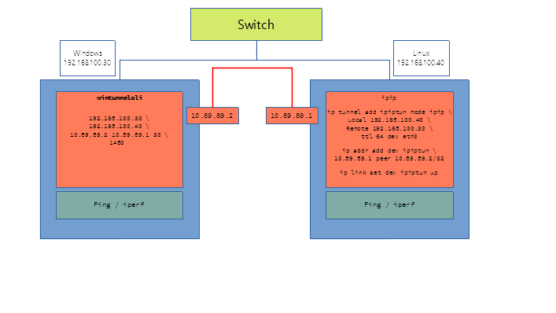

Windows 환경에서 ipip 를 구현해 보려고 했다. 

https://www.lowendtalk.com/discussion/34271/ipip-tunnel-support-for-windows

* winpcap 설치 
portable? https://www.winpcap.org/install/ 

run
wintunnelcli-1.01.exe 

```
C:\Users\doc\Desktop>wintunnelcli-1.01.exe
wintunnelcli [LocalAddress] [RemoteAddress] [EncapsulatedLocal] [EncapsulatedRemote] [NetworkCIDR] [InnerMTU]
C:\Users\doc\Desktop>wintunnelcli-1.01.exe 192.168.77.137 192.168.77.89 10.89.89.2 10.89.89.1 30 1480 


LOCALIP="192.168.77.89"
REMOTEIP="192.168.77.137"

ip tunnel add ipiptun mode ipip local $LOCALIP remote $REMOTEIP ttl 64 dev eth1
ip addr add dev ipiptun 10.89.89.1 peer 10.89.89.2/32
ip link set dev ipiptun up


