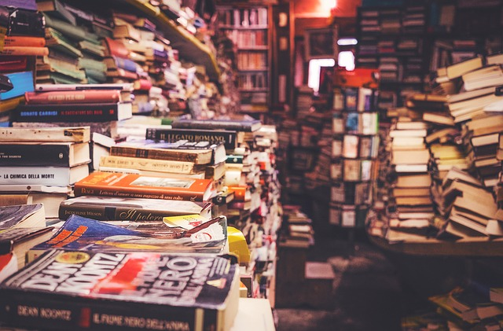
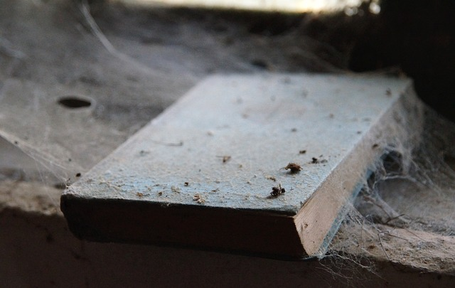
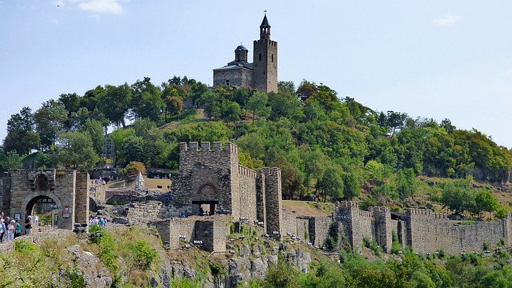

Donation과 Fund 를 받아서 21세기의 Alexandria library 를 만드는 것. 이제까지 머리속에 들어 있던 아이디어를 적어 본다. 

### Purpose

활자 문명의 종말이 다가온다. 물질적으로 가장 풍성한 이 때에, 대학과 로컬정부가 운영하는 도서관은 통폐합되고 디지털화 되어 가면서 수 많은 책들이 파기되고 있다. 
고 문서는 수집하는 사람들이 있고 박물관이나 국립 도서관 등이 할 일과 분리 하여 현대 인류 문명의 아카이빙이 필요하다고 생각한다. 
이는 세대를 거듭하여 운영 하여 후손에 물려 줄 유산이다. 

### Location 

인류 역사의 거대한 교유의 상징인 실크로드의 양 쪽 끝 중 하나를 생각 해 봤다. 중국 구 장안시 또는 동해안 끝, 터키 이스탄불 그러나 독재 정권 때문에 정치적으로 불안정한 문제가 있고 운영이 힘든(비싼) 문제가 있다.
개인적인 편의의 이유이며 콘스탄티노플 근처이고 오래 된 문명의 건물과 환경을 유지하고 있는 불가리아의 Veliko tarnovo 도 적정할 것 같다. 그리고 이쪽이 정부의 지원을 받기에 더 편할 수도 있을 것으로 예상된다. 

### Funding
* 관광지로의 가치가 있다. 소정의 입장료를 받아 운영하고 관광지화가 되면 지역/국가 경제에도 도움이 될 수 있다. 
* 책 기부. 
* 웹서비스 운영 및 책 판매. 여분의 책을 온라인 판매 
* Exhibition. 큐레이터가 테마를 정해서 진행 

### Maintainace
* 태양광을 피하도록 실내에 서고를 구성 하지만 항온항습의 예산을 절약하고 자동화를 위해 다음을 고려한다. 
* 책 단위가 아닌 박스(바구니) 단위로 사서에게 이동. 1 박스에 가변적으로 10~15권이 들어감 
* 책 1권 단위로 지퍼백에 넣거나 박스를 외부 환경과 차단 할 수 있는 뚜껑을 단다. 
* 쌓은 책이 ledge 형태가 되지 않도록 큰 책에서 작은 책순으로 가로로 쌓는다.
* 커버를 덮기전에 언제나 사진을 찍어서 보관한다. 
* 기존 서점처럼 모든 책에 관리 code 를 부여 하지 않고 바구니 단위로 부여해도 관리가 가능 할 것 같다. 
* ISBN 이 없는 책도 취급
  
### Technique 
* 서고에서 바구니를 넣고 빼는 정리에 robot 도입.  
* Barcode/QRcode 를 활용하여 책이 어느 서고에 있는지 등록 하여 DataBase 에 기록 
* Multi-Language Online Search 
* Virtual 서고 사진 열람 
 